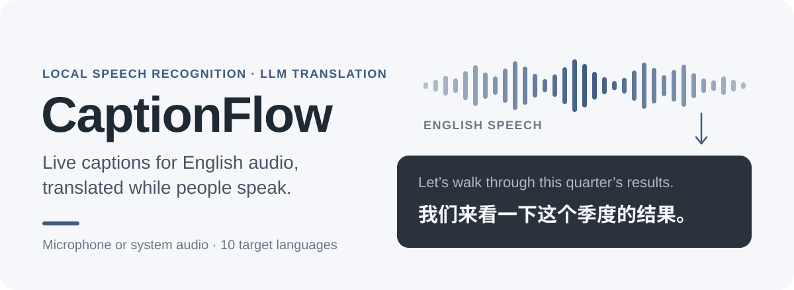
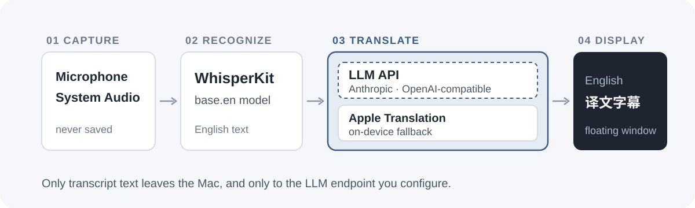

[English](README.md) · [下载](https://github.com/HuangChenning/captionflow/releases/latest) · [版本发布](https://github.com/HuangChenning/captionflow/releases)

CaptionFlow 是一款 macOS 应用，为英文音频（视频、直播、播客、线上会议）显示实时翻译字幕。语音在你的 Mac 本地识别，识别出的英文文本交给你配置的大模型翻译，对方还在说，你已经能读到意思。

## 它能做什么

| 方面 | 内容 |
| --- | --- |
| 音频源 | 麦克风、全部系统音频，或单个应用的声音 |
| 菜单栏 | 开始/停止、音频源、目标语言和设置都在菜单栏图标里 |
| 字幕窗 | 置顶的悬浮字幕窗，可拖动、可调整大小；字号、颜色和背景不透明度可调 |
| 快捷键 | 全局快捷键可自定义；默认 ⌃⌥S 开始/停止，⌃⌥H 显示/隐藏字幕窗，⌃⌥M 字幕窗移到下一块屏幕，⌃⌥A 切换音频源 |
| 语音识别 | WhisperKit `base.en`，仅英文，本地运行 |
| 翻译 | 你的大模型（Anthropic 或 OpenAI 兼容），Apple 本地翻译先出结果；也可选仅本地 / 仅大模型模式 |
| 目标语言 | 简体中文、繁体中文、日语、韩语、西班牙语、法语、德语、俄语、葡萄牙语、阿拉伯语 |
| 模型 | 可保存多个模型配置，支持添加、编辑、删除和测试连接 |
| 更新 | 通过 Sparkle 与 GitHub Releases 自动检查更新 |

## 工作原理



1. **采集**：收听麦克风、Mac 播放的全部声音（系统音频），或单个应用的声音。音频不会写入磁盘。
2. **识别**：[WhisperKit](https://github.com/argmaxinc/WhisperKit) 在 Mac 本地把英文语音转成文本。
3. **翻译**：英文文本发送到你配置的大模型端点（Anthropic Messages 或 OpenAI 兼容 API）。先显示系统自带的 Apple 本地翻译，大模型结果到达后再替换；大模型失败时保留本地译文。
4. **显示**：悬浮字幕窗在其他应用之上显示最新一句英文和译文，并随上下文增加持续修订。

## 快速开始

1. 从 [Releases](https://github.com/HuangChenning/captionflow/releases/latest) 下载最新的 `CaptionFlow-x.y.z.zip`，把 `CaptionFlow.app` 拖到「应用程序」。
2. 应用暂未公证。首次打开时右键点击 `CaptionFlow.app` →「打开」，再确认一次。
3. 打开「设置 → 模型」，点击「添加模型」，填写 API 格式、Base URL、模型名称和 API Key，可用「测试连接」检查是否可用。
4. CaptionFlow 没有主窗口，操作都在菜单栏图标里（点击 Dock 图标会打开设置）。点击菜单栏图标，在 **音频源** 中选择麦克风、全部系统音频或单个应用，再点击 **开启实时字幕**。macOS 会请求对应权限（麦克风，或屏幕与系统录音）。字幕显示在屏幕底部的悬浮字幕窗中，可拖到任意位置，并在「设置 → 文本外观」和「显示设置」中调整。

第一次开始时会下载 WhisperKit 英文模型，耗时比之后更长。之后 CaptionFlow 通过 Sparkle 自动更新，也可以用菜单「CaptionFlow → 检查更新…」或「设置 → 软件更新」手动检查。

## 隐私

- 麦克风和系统音频的原始声音只在本机处理，从不保存。
- 只有识别出的英文文本和你的翻译指令会发送到你配置的大模型端点。选择仅本地翻译时，任何内容都不会离开本机。
- API Key 保存在 macOS 钥匙串，不写入 UserDefaults。

## 环境要求

- Apple Silicon Mac
- macOS 15 Sequoia 或更高版本

## 从源码构建

需要 Xcode 16 或更高版本，以及 [XcodeGen](https://github.com/yonaskolb/XcodeGen)。

```bash
git clone https://github.com/HuangChenning/captionflow.git
cd captionflow
xcodegen generate
xcodebuild -scheme CaptionFlow -destination 'platform=macOS' build
xcodebuild test -scheme CaptionFlow -destination 'platform=macOS'
```

## 限制

- 说话语言必须是英文。
- 暂不支持会话历史和导出。
- 安装包为临时签名、未经公证，首次打开时 macOS 会弹出警告。

## License

许可证尚未确定。
